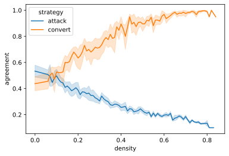
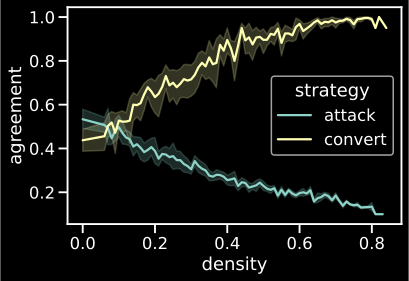

Tracking agreement in debate simulations
****************************************

.. note:: This recipe reproduces results from Chapter 6 in [Betz2013]_.

We want to know whether argumentation is conducive to consensus for agents with
randomly initialised belief systems.

We begin by initialising two sets of agents, one equipped with the “attack” 
strategy, the other one with the “convert” strategy.

.. code:: python

    from taupy import * 
    attack_population = [Position(debate=None, introduction_strategy=strategies.attack) for _ in range(2)]
    
    convert_population = [Position(debate=None, introduction_strategy=strategies.convert) for _ in range(2)]
    
Next, conduct the experiment with fairly standard simulation settings:

.. warning::

	The following Python code executes 12 simulations in multiprocessing twice. 
	Unless otherwise specified, multiprocessing will use all CPUs available on 
	your machine. On modern consumer hardware, a simulation with 20 sentences 
	takes about 10–30 minutes, depending on the number of agents. If your machine 
	can execute four jobs at the same time, the worst scenario is 180 minutes 
	execution time for both experiments. A machine with	12 CPUs might do the same 
	in less than 30 minutes.
	
	.. hint::
	
		The :py:mod:`multiprocessing` module can show the number of available
		CPUs on a machine
		
		>>> import multiprocessing
		>>> multiprocessing.cpu_count()

.. code:: python
    
    attack_experiment = experiment(
        n=12, 
        simulations={"positions": attack_population, "sentencepool": "p:20"},
        runs={"max_density": 0.8}
        )
        
    convert_experiment = experiment(
        n=12, 
        simulations={"positions": convert_population, "sentencepool": "p:20"},
        runs={"max_density": 0.8}
        )
        
Let's now analyse all our data. We are interested in the mean population-wide
agreement at each debate stage, and the inferential density of that debate stage
– this should tell us whether the continued exchange of arguments leads 
increases mean agreement between agents, and is thus consensus-conducive.

.. code:: python
    
    attack_eval = Evaluation(
        debate_stages=attack_experiment,
        list_of_positions=[e.positions for e in attack_experiment]
        )
        
    attack_eval.densities()
    attack_eval.agreement_means()
    
    convert_eval = Evaluation(
        debate_stages=convert_experiment,
        list_of_positions=[e.positions for e in convert_experiment]
        )
        
    convert_eval.densities()
    convert_eval.agreement_means()
    
Our raw data is generated! Now let's combine this data and plot it:

.. code:: python

	import pandas as pd
	import seaborn

	# Add a column to our data indicating which strategy was in use:
	attack_eval.data["strategy"] = "attack"
	convert_eval.data["strategy"] = "convert"

	our_data = pd.concat([attack_eval.data, convert_eval.data])
	# Convert data to types recognised by seaborn
	our_data["agreement"] = our_data["agreement"].astype("float64")
	our_data["density"] = our_data["density"].astype("float64").round(2)
	
	# Plot
	seaborn.lineplot(data=our_data, x="density", y="agreement", hue="strategy")
    

   

